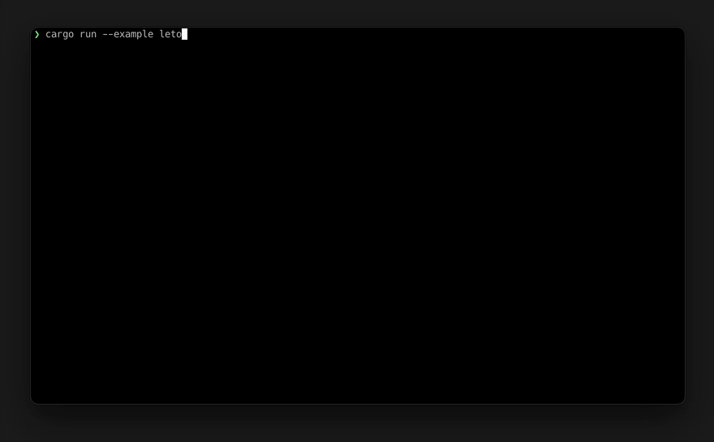

# opentui-core

Rust bindings to the [sst/opentui](https://github.com/sst/opentui) terminal rendering engine. Direct access to the high-performance Zig core without a JavaScript/TypeScript runtime.



## Features

- **Double-buffered diff rendering** -- only changed cells produce ANSI output
- **Real alpha blending** -- Porter-Duff compositing with f32 RGBA
- **Scissor clipping** -- nested rectangular viewport masking
- **Opacity stacking** -- hierarchical transparency layers
- **Buffer compositing** -- draw one buffer onto another
- **Text editing** -- rope-backed edit buffers with undo/redo, word navigation, and visual cursor
- **Syntax styles** -- named style registry for highlighting
- **Hyperlinks** -- OSC 8 link support
- **Kitty keyboard protocol**
- **Unicode/grapheme-aware** text handling

## Requirements

- Rust 1.70+
- [Zig 0.15.2](https://ziglang.org/download/) (for building the core library)

## Install

```sh
cargo add opentui-core --git https://github.com/spence/opentui-core-rs
```

## Quick start

```rust
use opentui_core::{Renderer, Rgba};

let mut renderer = Renderer::new(80, 24).unwrap();

let buf = renderer.next_buffer();
buf.clear(&Rgba::BLACK);
buf.draw_text("Hello, opentui!", 0, 0, &Rgba::WHITE, None, 0);
buf.fill_rect(0, 2, 40, 3, &Rgba::from_hex("#1a1a2e").unwrap());
drop(buf);

renderer.render(false);
```

The renderer diffs back vs front buffers and emits only the ANSI sequences needed to update changed cells.

## Architecture

```
Your app
  │
  ├─ renderer.next_buffer()  →  BufferRef
  │       │
  │       ├── clear(bg)
  │       ├── draw_text(text, x, y, fg, bg, attrs)
  │       ├── fill_rect(x, y, w, h, color)
  │       ├── draw_box(...)
  │       ├── push_scissor_rect / pop_scissor_rect
  │       ├── push_opacity / pop_opacity
  │       └── draw_frame_buffer (composite)
  │
  └─ drop(buf)  →  renderer.render(force)
                      │
                      ├── diff back vs front
                      ├── ANSI output (changed cells only)
                      └── swap buffers
```

`BufferRef` borrows the renderer mutably. Drop it before calling `render()`.

## API overview

### Drawing

```rust
buf.clear(&bg);
buf.draw_text("hello", x, y, &fg, Some(&bg), 0);
buf.fill_rect(x, y, w, h, &color);
buf.draw_box(x, y, w, h, &border_chars, packed, &border, &bg, title, bottom);
buf.draw_char(ch, x, y, &fg, &bg, 0);
buf.set_cell_blended(x, y, ch, &fg, &bg, 0);  // alpha blend
buf.draw_frame_buffer(dx, dy, &source, sx, sy, sw, sh);
```

### Scissor clipping

```rust
buf.push_scissor_rect(10, 5, 30, 10);
buf.fill_rect(0, 0, 80, 24, &red);  // clipped to 30x10 region
buf.pop_scissor_rect();
```

### Opacity

```rust
buf.push_opacity(0.5);
buf.draw_text("faded", 0, 0, &white, None, 0);
buf.pop_opacity();
```

### Text editing

```rust
let mut eb = EditBuffer::new(WidthMethod::Wcwidth).unwrap();
eb.set_text("fn main() {}");
eb.set_cursor(0, 3);
eb.insert_text("hello");

let mut view = EditorView::new(&eb, 60, 20).unwrap();
view.set_viewport(0, 0, 60, 20, false);
view.set_wrap_mode(WrapMode::Word);

buf.draw_editor_view(&mut view, 0, 0);
```

### Hyperlinks

```rust
let link_id = link_alloc("https://example.com");
let attrs = attributes_with_link(0, link_id);
buf.draw_text("click me", x, y, &fg, None, attrs);
```

## Examples

```sh
cargo run --example hello  # minimal render
cargo run --example leto   # interactive trace viewer (shown in demo above)
```

## Claude Code plugin

Install the skill to let Claude build TUIs with this crate:

```
/plugin marketplace add spence/opentui-core-rs
/plugin install opentui-core
```

Then use `/opentui-core:build-tui <description>`.

## License

MIT
